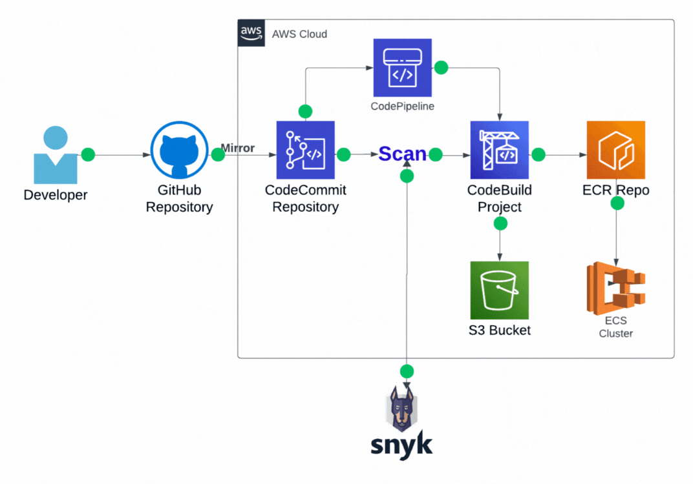

# AWS-DevSecOps-Project
AWS DevSecOps Project

### Architectural Diagram



# Prerequisites

- AWS Account
- Github account
- Snyk Account

# Services Covered

- AWS CodeCommit
- AWS CodeBuild, CodePipeline
- AWS ECR (Elastic Container Registry)
- AWS ECS (Elastic Container Service)


# Step 1

- Create codecommit repository
- Clone the project repository from github (Open cloudshell and clone the repo using below command)

To create code commit repository follow the below steps;


**Once the codecommit repository has been created we need to clone the project repository from github. To get the project repo click on the link below;**

```
https://github.com/sanju2/AWS-DevSecOps-Project.git
```

 **To clone the repository from github to codecommit we can use cloudshell from AWS**

 -	Click on the icon to open cloudshell terminal

 


**It will ask you enter username and password. Enter username as your github username and under password we need to add the access token of github. If you don’t know how to create access token then follow the below steps;**

### Create access token

Go to Github and click on your profile --> settings


**Go to github settings and scroll down to the bottom. In the left hand side you can see an option called Developer settings. Open that tab.**


**Click on generate new token (classic) tab to generate an access token. Make sure you keep it somewhere safe.**

Go back to cloudshell and clone using this token.

- Next we need to mirror the repository we cloned. To mirror use the below commnad (if you are getting any error says name already exist the change the name or repository.)

```
git clone --mirror https://github.com/sanju2/AWS-DevSecOps-Project.git AWS-DevSecOps-Project
```


Now we have cloned and mirror the repository from github. Next we need to push the code to codecommit repository. Let's see how to do that;

#### Push project repo to codecommit repository 

**To do this first we need to generate access token for IAM user as well. To create github access keys for IAM user follow the below steps;
Go to IAM console and open the IAM user that you have logged in or using.**


**Click on security credentials and scroll towards HTTPS Git credentials for AWS CodeCommit**


**Click on generate credentials and don’t forget to download the credentials**

**Once the credentials has been generated we can go ahead and push the git repo to codecommit**


-	Copy the codecommit HTTPS url and go to cloudshell

```
#Change directory to the mirror repo and enter the below command.
git push https://git-codecommit.us-east-2.amazonaws.com/v1/repos/AWS-DevSecOps-Project
```
(under username and password enter the username and password created for HTTPS Git credentials for AWS CodeCommit)


**Now if we go to codecommit repository we can see all the code has been pushed😎.**


# Step 2

- Create ECR repository

To create ECR repository follow the below steps;


# Step 3 
- Create Build project
- Add ECR permission for the IAM role create for build project.

Go to codecommit console page and under codebuild click on build projects


**Expand additional configuration to add the environment variables and add the below variables.**
(Make sure add the region and ECR repo name as per your configuration.)


- Once the codebuild has been created click on start build.


**We can see the build got failed. The error is because of the role permission. We need to manually add the ECR permission for the IAM role. To do that go to codebuild IAM role and add the ECR permission.**

(Click on the service role and it will open the IAM role interface.)


Add the below policy in the IAM role 
```
{
    "Statement": [
      {
        "Action": [
          "ecr:BatchCheckLayerAvailability",
          "ecr:CompleteLayerUpload",
          "ecr:GetAuthorizationToken",
          "ecr:InitiateLayerUpload",
          "ecr:PutImage",
          "ecr:UploadLayerPart"
        ],
        "Resource": "*",
        "Effect": "Allow"
      }
    ],
    "Version": "2012-10-17"
  }

```
-	Give any role name and click on create policy


**Once you add inline policy then try build again. This time we can see it is success**


**If you are still getting the error then check the IAM role and make sure you have the below permissions attached**


**Now we can see the build process is success. If we go to ECR repository we can see the image uploaded.**


 
# Step 4
- Create pipeline
- Add new stage and connect the snyk account to check the vulnerabilities.

To create codepipeline follow the below steps;
 


**Skip deploy stage and create pipeline**


**Wait for some time and we can see the pipeline success**


**If you are facing any issue while creating pipeline then add the ECR permission we have added for codebuild to the code pipeline role as well.**


# Step 5
- Create ECS cluster
- Create task definition (add port 5000 because our app is running in this port also add tag:latest after the image URI)
- Create service (make sure the security group has port 5000 added)
- Once service has been created we can see the task running. Go to networking from task tab and copy the Public IP and add :5000 in the end. And we can see our app running.

# Step 6
- Deployment
Add new stage in pipeline called deployment and add the ECS cluster in that. 
